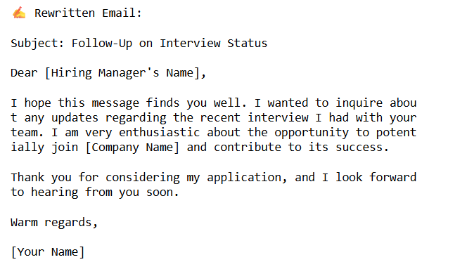
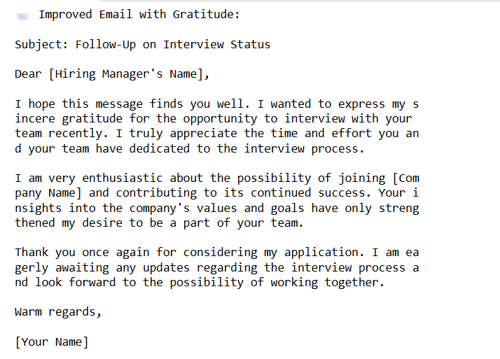
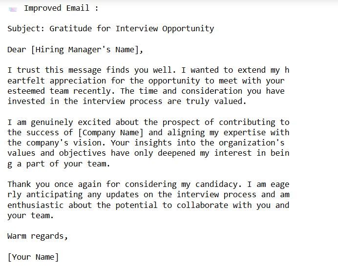

#  Prompt Engineering – Email Rewrite Project

This project demonstrates prompt engineering to transform a casual follow-up email into a formal, professional, and concise version using OpenAI's `gpt-3.5-turbo`.

##  Prompts Used:
1. Rewriting a casual email into a formal tone.
2. Enhancing gratitude and professionalism.
3. Making the email more confident while retaining the respectful tone.

##  Tools Used
- Google Colab
- OpenAI API
- Python
- Output screenshots

## 🖼️ Output
Included images: `prompt1_output.png`, `prompt2_output.png`,`prompt3_output`
🔗 [View the Colab notebook](./Email__prompt.ipynb)

---

✨ Made by Yashika Gupta (SE23UCSE190), Engineer student @ Mahindra University
